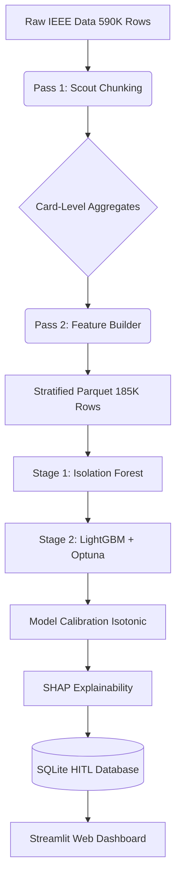

# 🏦 Financial Crime Intelligence Platform

> **Production-grade AML & Fraud Detection System**
> Built with an Out-of-Core memory-optimized pipeline, Two-Stage modeling (Isolation Forest + LightGBM), and a full Human-in-the-Loop investigator dashboard.

[](https://python.org)
[](https://lightgbm.readthedocs.io)
[](https://streamlit.io)
[](https://www.kaggle.com/c/ieee-fraud-detection)

---

## 📋 Table of Contents

- [Business Problem](#-business-problem)
- [Architecture & Pipeline](#-architecture--pipeline)
- [Dataset](#-dataset)
- [Out-of-Core Engineering](#️-out-of-core-engineering)
- [Models & Performance](#-models--performance)
- [Explainability (XAI)](#-explainability-xai)
- [Human-in-the-Loop Dashboard](#-human-in-the-loop-dashboard)
- [Project Structure](#-project-structure)
- [Usage](#-usage)
- [Resume Impact](#-resume-impact)

---

## 💼 Business Problem

Financial institutions lose billions annually to credit card fraud. Traditional rule-based systems generate excessive false positives, wasting investigator time and causing friction for legitimate customers.

This platform addresses three core engineering and business challenges:

| Challenge | Solution |
|---|---|
| **Memory Constraints** | Out-of-Core Two-Pass chunked pipeline capping peak RAM at 3.6 GB. |
| **Severe Imbalance** | 3.5% fraud rate mitigated via stratified downsampling (1:8 ratio). |
| **Model Explainability** | SHAP integrated directly into a Streamlit investigator dashboard. |

---

## 🏗️ Architecture & Pipeline

The system is designed as a monolithic, end-to-end Python pipeline (`ieee_cis_pipeline.py`) that processes raw data, engineers features, trains models, and initializes the database for the frontend dashboard.



---

## 📊 Dataset

**IEEE-CIS Fraud Detection Dataset**

| Metric | Value |
|---|---|
| **Total Transactions** | 590,540 rows |
| **Raw Columns** | ~400 features |
| **Engineered Features** | 448 features |
| **Fraud Rate** | ~3.5% (Class Imbalance) |
| **Identity Data** | Device types, OS versions, network info |

---

## ⚙️ Out-of-Core Engineering

To process 590K high-dimensional rows on a standard 12GB laptop, a **Two-Pass Out-of-Core** architecture was engineered.

### Pass 1: The Scout
- Reads the dataset in chunks of `100,000` rows loading **only 8 essential columns**.
- Builds a global in-memory dictionary tracking the historical transaction count and amounts for every unique credit card (`card1`).
- Calculates lifetime Mean, Standard Deviation, and Max spend per card.

### Pass 2: The Builder
- Reads the full dataset in chunks.
- Engineers independent row-level features (`hour_of_day`, `log_amount`, `is_round_amount`).
- Joins the global velocity statistics from Pass 1 to calculate deviation metrics (e.g., `amt_vs_card_mean`).
- Applies strict **dtype downcasting** (`float64` → `float32`, `int64` → `int32`), cutting chunk memory footprint in half.
- Applies **Stratified Downsampling**, keeping 100% of fraud rows and sampling normal rows at a 1:8 ratio.
- Deletes the chunk from RAM instantly (`del chunk; gc.collect()`).

**Result:** 448 features engineered across 590,000 rows while strictly limiting peak RAM usage to **3.6 GB**.

---

## 🤖 Models & Performance

### 1. Baselines vs Final Model
To prove the necessity of advanced gradient boosting, the dataset was benchmarked against linear and bagging baselines.

| Model | Architecture | PR-AUC (Holdout) | Result |
|---|---|---|---|
| **Logistic Regression** | Linear | 0.278 | Failed to capture non-linear fraud patterns |
| **Random Forest** | Bagging | 0.765 | Struggled with extreme class imbalance |
| **LightGBM** | Gradient Boosting | **0.893** | **3.2x higher PR-AUC than baseline** |

### 2. Two-Stage Detection
1. **Stage 1 (Unsupervised):** An `Isolation Forest` calculates an anomaly score for every transaction, capturing zero-day, unseen fraud patterns.
2. **Stage 2 (Supervised):** `LightGBM`, hyperparameter-tuned via **Bayesian Optuna (40 trials)**, uses the 448 features plus the anomaly score to generate a final risk probability.

### 3. Probability Calibration
Because Tree-based models push probabilities away from 0 and 1, the LightGBM outputs were calibrated using **Isotonic Regression**. This ensures a predicted 80% risk actually represents an 80% real-world probability of fraud.

---

## 💡 Explainability (XAI)

The pipeline integrates **TreeSHAP** to provide regulatory-grade transparency into the LightGBM decisions.

- **Global Importance:** Identifies the top factors driving fraud across the entire portfolio (e.g., specific device types or card velocity).
- **Local Explanations:** Every transaction pushed to the dashboard includes a waterfall breakdown of exactly why the model flagged it, enabling investigators to make fast, informed decisions.

---

## ⚖️ Human-in-the-Loop Dashboard

Transactions with a "Medium" or "High" risk score are pushed directly to a local **SQLite** database. A **Streamlit** web application serves as the frontend for fraud investigators.

**Dashboard Features:**
- **Investigator Queue:** Review pending alerts sorted by risk score.
- **SHAP Breakdown:** View exactly why the model flagged the transaction.
- **Feedback Loop:** Investigators can click `Approve` or `Mark as Fraud`, which updates the SQLite database to be used as ground-truth labels for future model retraining.

---

## 📁 Project Structure

```
financial-crime-intelligence/
│
├── data/                      ← Raw IEEE CSVs, Parquet cache, SQLite DB
├── configs/
│   └── config.yaml            ← General configuration settings
├── dashboards/
│   └── ieee_investigator_app.py ← Streamlit human-in-the-loop dashboard
├── models/                    ← Trained models (LightGBM, IF, Calibrator)
├── reports/
│   ├── figures/               ← HTML Plotly charts (ROC, PR, SHAP, etc.)
│   ├── interview_prep.tex     ← Interview Q&A guide
│   └── project_report.tex     ← Full LaTeX project report
├── src/
│   └── monitoring/
│       └── init_ieee_hitl_db.py ← SQLite DB initializer for dashboard
├── ieee_cis_pipeline.py       ← The main end-to-end ML pipeline script
├── requirements.txt
└── README.md
```

---

## 🚀 Usage

### 1. Run the End-to-End Pipeline
Execute the main script to process the data, train the models, generate the SHAP plots, and initialize the SQLite database:
```bash
python ieee_cis_pipeline.py
```

### 2. Launch the Investigator Dashboard
Spin up the interactive Streamlit UI to review flagged transactions:
```bash
streamlit run dashboards/ieee_investigator_app.py
```

*(Note: Navigate to `http://localhost:8501` in your browser)*

---

## 📝 Resume Impact

> *"Built an end-to-end Two-Stage fraud detection pipeline (unsupervised Isolation Forest + LightGBM) for 590K transactions. Engineered 448 velocity features via a Two-Pass Out-of-Core chunked pipeline with dtype downcasting, strictly capping peak RAM at 3.6 GB. Benchmarked LightGBM against linear baselines, achieving a 3.2x increase in PR-AUC (0.893) on a 37K holdout set. Mitigated 3.5% class imbalance via stratified downsampling, and tuned hyperparameters via Bayesian Optuna. Deployed a Streamlit investigator dashboard backed by SQLite and TreeSHAP explainability (XAI)."*
